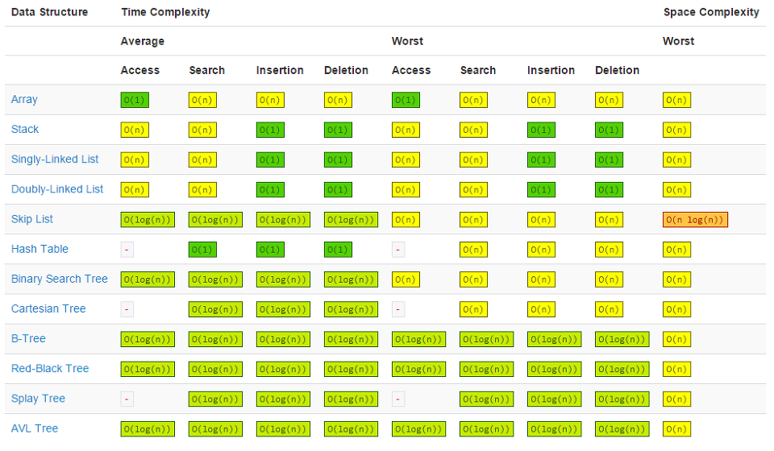
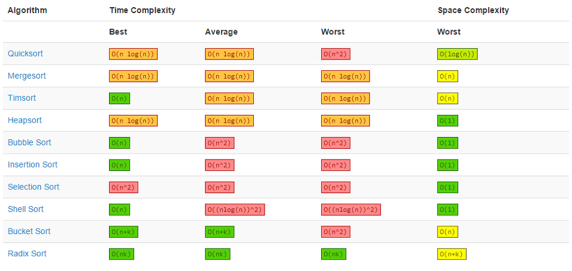

# 알고리즘의 성능 분석

문제를 해결하는 데에 사용한 **자원**과 **시간**을 분석하는 것을 말한다.<br>

- 알고리즘이 동작을 시작하여 결과가 반환될 때까지 실행에 걸리는 **시간**
- 컴퓨터가 해당 알고리즘을 연산하며 사용하는 메모리와 같은 **자원**

<br>

> 1

## 알고리즘 성능 분석의 필요성

1. 처리하는 데이터의 양이 과거와는 비교가 안될 정도로 많아짐
2. 같은 자원을 이용하면서 같은 결과를 도출할 수 있음 <br>

입력하는 데이터의 양이 적은 경우엔 알고리즘 간 성능차이가 크지 않지만, 입력하는 데이터의 양이 많아질 경우 그 차이는 기하 급수로 증가하게 된다.
- 예시

|입력한 데이터의 개수|알고리즘 A (n<sup>2</sup>) |알고리즘 B (2<sup>n</sup>)|
|:---:|:---:|:---:|
|n = 6|36 초|64 초|
|n = 100|10,000 초|4 * 10<sup>22</sup> 년|

- 효율적인 알고리즘 <br>
실행에 걸리는 시간이 짧고, 컴퓨터 내의 자원을 덜 사용하는 알고리즘

<br>

> 2

## 조건
1. 동일한 하드웨어 환경에서 비교를 진행해야 한다.
2. 알고리즘을 구현한 소프트웨어의 환경을 고려해야 한다.
    - 동일한 하드웨어에서도 C언어와 같은 컴파일 언어는 인터프리터 언어를 사용한 경우보다 빠르다.

<br>

> 3

## 시간 복잡도
시간 복잡도(Time Complexity)는 알고리즘을 수행하는 데 **연산**들이 몇 번 수행되는지를 숫자로 표기한다.<br> (절대적인 실행시간이 아님)

- 연산 : 산술, 대입, 비교, 이동 <br>

연산의 수행 횟수는 입력한 데이터의 개수에 따라 변한다.<br>
따라서 데이터의 수 n에 대해 연산의 수행 횟수를 나타낸 것을 **시간 복잡도 함수**라 하며, 수식으로는 T(n)이라 표현한다.

### 연산 횟수를 카운팅하는 예시

```
// 알고리즘 A
result = n * n


// 알고리즘 B
sum = 0
for _ in range(n):
    sum += n


// 알고리즘 C
sum = 0
for i in range(n):
    for j in range(n):
    	sum += 1;
```

<br>

|연산 종류|알고리즘 A|알고리즘 B|알고리즘 C|
|:---:|:---:|:---:|:---:|
|대입 |1|n + 1|n * n + 1|
|덧셈 ||n|n*n|
|곱셈 |1|||
|나눗셈 ||||
|전체 연산|2|2n + 1|2n<sup>2</sup> + 1|

- 
- 하나의 연산이 t만큼 시간이 필요하다면,
    - 알고리즘 A: 2t
    - 알고리즘 B: (2n + 1)t
    - 알고리즘 C: (2n<sup>2</sup> + 1)


### 빅오(Big-O) 표기법
1. 시간 복잡도 함수에서 **상대적으로 불필요한 연산**을 제거
2. 알고리즘 분석을 조금 더 간편하게 할 목적으로 시간 복잡도를 표기하는 방법.

- 상대적으로 불필요한 연산 == 데이터의 입력 개수에 상관 없는 연산들
    - == T(n)에서 상수로 표현되는 수들

#### 생각 따라가기
[위](#알고리즘-b)의 예시로 나온 연산 중 `알고리즘 B`를 살펴보자.<br>
1. 실제로는, 하나의 루프 제어문은 `2n + 2`의 연산을 추가하게 되어 전체적으로 보면 `4n + 3`의 연산을 필요로 하게 된다.
2. 하지만 정확한 연산의 개수가 아닌 알고리즘들의 상대적 성능을 비교하고 싶은 것 이기 때문에
3. 데이터의 양이 매우 많다 가정하면, 상수들의 중요도는 낮아지고 실행시간은 `n`에 정비례 하게 된다.
- 이를 빅오 표기법으로 나타내면, **O(n)** 이라 한다.

* 데이터의 양 변화에 따른 실행시간 변화 표

|Big-O|1|4|8|16|
|:---:|:---:|:---:|:---:|:---:|
|O(1) |1|1|1|1|
|O(log<sub>2</sub>n) |0|2|3|4|
|O(n) |1|4|8|16|
|O(nlogn) |2|8|24|64|
|O(n<sup>2</sup>) |1|16|64|256|
|O(n<sup>3</sup>) |1|64|512|4096|
|O(2<sup>n</sup>) |2|16|256| 65536|
|O(n!) |1|24|40,326|20922789888000|

<br>

> 4

## 최선, 평균, 최악
```
교육 초반, for문을 3번씩 중첩시켰는데도 그렇게 많은 시간이 안 걸리는 문제들을 푼 적이 있을 것입니다.
그런데 요즘 푸는 문제들은 반복문 줄인다고 줄였는데도 제한시간 초과가 떠 눈앞이 흐려지곤 할겁니다..
이는 입력되는 데이터의 양이 서로 달라서 "O(n)"의 상하관계와는 맞지 않는 결과가 나온 것 입니다.
```
- 예를 들어, 정렬이 대부분 되어 있는 데이터를 정렬하는 시간이 뒤죽박죽인 데이터를 정렬하는 시간보다 훨씬 적을 것이다.

- 이러한 데이터의 유형에 따라 알고리즘의 효율성 검사 결과 또한 달리 나오는데, 이를 3가지 경우로 나누어서 평가함.

    1. 최선의 경우
    2. 평균적인 경우
    3. 최악의 경우

<br>

- 알고리즘의 효율성 평가에는 주로 최악의 경우에 대한 시간 복잡도를 계산하여 사용<br>

<center> [ 아무리 많이 걸려도 이 시간 안에는 끝날 것 ] </center>

<br>

> 5

## 시간 복잡도 줄이는 법
동일한 동작을 수행하는 알고리즘은 최대한 시간이 적게 걸리는 것이 좋다.

1. 반복문의 숫자를 줄이기
    - 반복문이 시간소모에 가장 큰 영향을 미침
2. 적절한 자료구조 이용
    - 주어진 데이터를 원하는 대로 계산하는 과정에서 제일 효율적이 자료구조 찾기
3. 적절한 알고리즘 이용
    - 대표적으로 이진탐색, 그리디, 정렬 알고리즘 등이 있음
    - 같은 정렬 알고리즘에서도 다양한 방법이 있기 때문에, 가장 효율적인 알고리즘을 찾는 것이 핵심

- 자료구조에 대한 시간 복잡도 표



- 배열의 정렬 알고리즘에 대한 시간 복잡도 표




<br>

> Reference

[코딩 팩토리](https://coding-factory.tistory.com/608)

[자료구조 개론](https://roi-data.com/entry/%EC%9E%90%EB%A3%8C%EA%B5%AC%EC%A1%B0-%EA%B0%9C%EB%A1%A0-1-%E2%91%A1-%EC%95%8C%EA%B3%A0%EB%A6%AC%EC%A6%98-%EC%84%B1%EB%8A%A5%EB%B6%84%EC%84%9D)