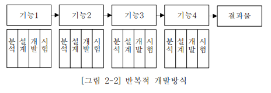
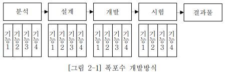
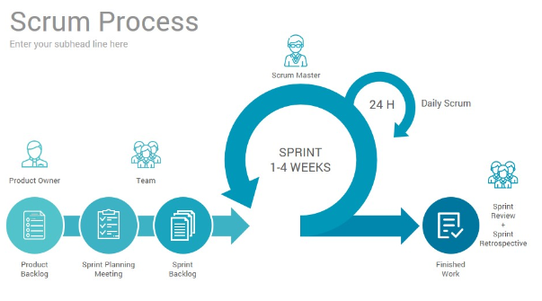

# Agile

- agile : 1. 날렵한, 민첩한 2. (생각이) 재빠른, 기민한

- keyword: <b>협력, 피드백</b>

- Agile 개념을 계승한 아래와 같은 개발론이 나오게 되었다.
  - 칸반(kanban)
  - 스크럼(scrum)
  - XP(eXtream Programming)
  - LSD(Lean SW Development)

- 2001년 17명의 소프트웨어 전문가들에 의해서 정의되어 발표된 애자일 소프트웨어 개발 선언을 근간으로 하는 개념이다.

<br>

## 선언문

```
우리는 소프트웨어를 개발하고, 또 다른 사람의 개발을
도와주면서 소프트웨어 개발의 더 나은 방법들을 찾아가고 있다.
이 작업을 통해 우리는 다음을 가치 있게 여기게 되었다.

공정과 도구보다 "개인과 상호작용"을,
포괄적인 문서보다 "작동하는 소프트웨어"를,
계약 협상보다 "고객과의 협력"을,
계획을 따르기보다 "변화에 대응하기"를 가치 있게 여긴다.
이 말은, 왼쪽에 있는 것들도 가치가 있지만,
우리는 오른쪽에 있는 것들에 더 높은 가치를 둔다는 것이다.
```

<br>
<hr>

## Agile 특징
<br>

#### 1. Agile 소프트웨어 개발은 반복적이고 지속적이다.
- 초기에 설정했던 계획이 변결될 수 있기에, 이러한 변화에 대응할 수 있어야 한다.

#### 2. 개인과 그 협력이 중요하다.
- 소프트웨어 개발에 관련된 모든 이해 관계자들은 각자 그 역할을 수행하고,<br>
 수평적인 상호작용과 협력관계를 형성해야 한다.
- 이는 소프트웨어 개발 계획과 그 내용의 변경이 이루어져야 할 때, <br>
 공정, 도구, 계약, 계획 문서 등의 원인으로 변경을 처리하는 일에 문제가 되지 않도록 하기 위해서 이다.

#### 3. 작동하는 소프트웨어를 만들어야 한다.
- 반복적이고 지속적으로 개발해야하기 때문에, <br>
 변화에 대응하기 위해서는 현재까지 만들어진 소프트웨어가 작동해야 하며 이를 사용할 수 있어야 한다.

<br>
<hr>

## 전통적인 개발 방법론의 문제점

<br>

폭포수(waterfall) 개발방식의 경우,

#### 1. 개발 단계가 완료 되어야 작동하는 소프트웨어를 시험할 수 있다.
- 모든 개발 요구사항을 대상으로 모든 단계를 거쳐나가기 때문에, <br>
 프로젝트 막바지가 되어야 고객이나 사용자가 구현된 소프트웨어를 확인할 수 있다는 뜻이다.
  - 프로젝트 후반부인 시험단계에서 니즈가 반영이 되었는가를 확인하는 고객(사용자)과의 갈등이 불가피하다.

#### 2. 분석-설계 단계에서 개발 범위의 전부와 세부사항을 모두 결정해야 한다.
- 프로젝트 초반에 예산의 대부분이 할당되는 개발 단계의 업무를 모두 정해버리면, <br> 프로젝트 진행 중 설계상, 혹은 개발상의 문제가 발생했을 때 다시 설계부터 하려면 비용과 일정 소모가 커지게 된다.

#### 3. 변화에 민감하게 대응하기 어렵다.
- 복잡하고 변화가 빠른 기업의 경우 (대부분의 기업이 그렇다.), <br>
 프로젝트 초반에 분석되고 설계된 개발 범위를 프로젝트 도중에 변경해야 하는 상황이 생기기 일수이다.
- 프로젝트 초반일 경우, 분석-설계단계만 반복하여 개발 단계로 진행하지 못한다.
- 이미 개발 단계로 진행했을 경우, 변경사항이나 추가적으로 필요한 부분을 수용하지 못하는 경우가 발생하면 분석단계부터 다시 시작해야할 수 있다.

<br>
<hr>

## 정리

- Agile 방법론은 각 기능들에 대해 분석-설계-개발-시험을 진행하기 때문에 변화에 대응하기 쉬운 모델이다.<br>

<br>

- 이에 반해 전통적인 개발 방법론은 모든 기능들을 포함하여 분석-설계-개발-시험을 하기 때문에 변화에 대응이 늦고, 버리는 비용이 많아진다. <br>

<br>

<br>
<hr>

### Agile 장점

1. 프로젝트 계획에 걸리는 시간을 최소화할 수 있다.
2. 점진적으로 테스트할 수 있어서 버그를 쉽고 빠르게 발견할 수 있다.
3. 계획 혹은 기능에 대한 수정과 변경에 유연하다.
4. 고객의 요구사항에 대해 즉각적인 피드백이 가능하며, <br>
프로토타입을 빠르게 출시할 수 있다.
5. 빠듯한 기한의 프로젝트를 빠르게 출시할 수 있다.

### Agile 단점

1. 확정되지 않은 계획 및 요구사항으로 인한 반복적인 유지보수 작업이 많다.
    - (으악!)
2. 고객의 요구사항 및 계획이 크게 변경될 경우 모델이 무너질 수 있다.
3. 개인이 아닌 팀이 중심이 되다보니 공통으로 해야할 작업이 많을 수 있다.
      - 회의, 로그 등
4. 확정되지 않은 계획으로 개발 진행시 이해하지 못하고 진행되는 부분이 많을 수 있다.

<br>
<hr>


## 예시 _ Scrum

- 프로젝트 관리에 대한 접근방식.
- 스프린트(sprint)라고 하는 단기 작업 블록을 통해 프로젝트를 진행하며, <br> 스프린트 기간을 정해두고 진행.
  - 스프린트 : 반복적인 개발 주기

<br>


<br>

### 1. 스프린트 시작
- Product Backlog: 프로젝트 요구사항(issue)
- Sprint Planning Meeting: back log에 쌓인 프로젝트 요구사항(issue)을 가지고, story point를 예측한다.
    - Story Point: 각 요구사항이 일정이 어느정도 소진될지 예측하는 것.
- Sprint Backlog: 스프린트를 진행할 issue들

### 2. 스프린트 진행
- grooming: 다음 스프린트에 들어가기 전, 다음에 진행할 스프린트 요구사항에 대해 리뷰.
- daily meeting: 진행사항을 간단하게 공유.

### 3. 스프린트 종료
- Sprint Review
  - 이슈의 진행정도 리뷰
  - 미비한 부분 리뷰

- Sprint Retrospective: 잘한것, 못한것, 개선해야하는 것에 대한 시간. (feedback 회의)


> reference

1. [게임화를 통한 애자일 프로젝트 관리 방법론 교육에 관한 연구](http://www.riss.kr/search/detail/DetailView.do?p_mat_type=be54d9b8bc7cdb09&control_no=b988515a7a017137ffe0bdc3ef48d419&outLink=K)
2. [agile이란 무엇인가](https://velog.io/@katanazero86/%EC%95%A0%EC%9E%90%EC%9D%BCagile%EC%9D%B4%EB%9E%80-%EB%AC%B4%EC%97%87%EC%9D%B8%EA%B0%80)