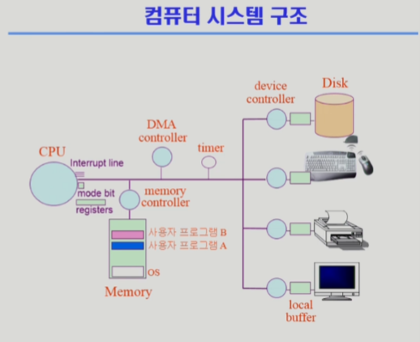

# 시스템의 구조와 프로그램 실행

  

## 컴퓨터 시스템 구조
1. Computer - CPU, Memory
    - Memory : CPU의 작업 공간
    - CPU : Memory에서 매 순간 명령어를 읽어와서 처리함.
2. Input/Output device - Disk(HDD, SSD), 모니터, 키보드, 마우스, 프린터기 등등

    - device controller : device 마다 해당 device를 전담하는 간이 CPU의 역할을 한다. Memory에서 I/O device에 원하는 행동을 동작하는 명령어를 보내면 그 일을 수행하도록 명령어를 처리한다.
    - local buffer : CPU-Memory의 관계처럼 controller의 작업공간을 담당한다.
  

## Computer의 부속 구조

1. `Input device`를 통해 들어온 명령들을 Memory에서 받고 CPU에서 처리하지만, CPU 에서도 자체적으로 명령들을 담아 둘 작은 공간이 존재하는데, 이를 `register`라 한다.

2. `CPU`가 지금 수행하는 동작이 운영체재에 의한 것인지, 사용자의 프로그램에 의한 것인지를 판단하는 `mode bit`이 존재한다.

3. 특정 프로그램이 `CPU`를 독점하는 것을 막기 위한 `timer`가 존재한다.
    - `timer`에 지정된 시간동안만 프로그램을 수행하고 다음 순위의 프로그램을 수행한다. (1초 보다 적은 시간)

4. 한 instruction이 증가하면, `Memory`에서 다음 동작을 받아오는데, 이를 구분해 주는 `Interrupt Line`이 존재한다.  
`timer`와 `interrupt line` 덕분에 사용자 프로그램, 운영체제를 교대로 수행할 수 있게 된다.
    - instruction이 증가한다 == `Memory`에서 온 명령을 `CPU`가 수행하면 증가한다고 하는 것 같음
    - 한 timer 주기 만큼 흐르면 instruction이 증가하고, 다음 동작을 수행 함.

  

> ### Device Controller
1. `I/O Device controller`
    - 각 IO 장치마다 달려있으며, 그 장치를 관리하는 일종의 작은 CPU
    - 제어 정보를 위해 `control register`, `status register`를 가짐
    - `local buffer`(간이 Memory)를 가짐
2. Input&Output은 `device`와 `local buffer` 사이에서 일어남
3. `Device controller`는 I/O 끝났을 때 interrupt로 CPU에 그 사실을 알림
  

> ### Mode bit
- 사용자 프로그램의 잘못된 수행으로 다른 프로그램 및 운영체제에 피해가 가지 않도록 하기 위한 보호장치

- `mode bit`을 이용하여 하드웨어적으로 두가지 모드의 operation 지원
    - 1 사용자 모드: 사용자 프로그램 수행
    - 0 모니터 모드: OS 코드 수행
        - 모니터 모드 == 커널 모드, 시스템 모드

    1. 보안을 해칠 수 있는 중요 명령어는 모니터 모드에서만 수행 가능한 "특권명령"으로 규정
    2. Interrupt나 Exception 발생 시 하드웨어가 mode bit을 0 으로 바꿈
    3. 사용자 프로그램에게 cpu를 넘기기 전에 mode bit을 1로 맞춤
  

> ### Timer
- `CPU`에서 하나의 프로그램을 수행하다가, 정해진 시간이 흐른 뒤 운영체제에게 제어권이 넘어가도록 인터럽트를 발생시킴
  

> ### Interrupt (운영체제 구동의 핵심)
- interrupt를 당한 시점의 `resgister`와 program counter를 저장해 둔 뒤, `CPU`의 제어를 interrupt 처리 루틴에 넘긴다.

- 넓은 의미에서...
    1. Interrupt _ 하드웨어 interrupt: 하드웨어가 발생시킨 인터럽트
    2. Trap _ 소프트웨어 interrupt:
        - Exception: 프로그램이 오류를 범한 경우
        - System call: 프로그램이 커널 함수를 호출하는 경우

- interrupt 처리 루틴 (Interrupt Service Routine): 해당 interrupt를 처리하는 커널 함수
- 사용자 프로그램에 의해 / Timer 에 의해 / keboard(device) controller 에 의해 등등 여러 종류의 interrupt가 존재 
각 interrupt마다 하는 일이 다른데, 각각의 루틴이 다르다

- (+) interrupt vetor : 해당 interrupt의 처리 루틴(함수)의 주소를 가지고 있음

#### I/O (입출력) 의 수행
- 모든 입출력 명령은 특권 명령이다. ~~(system!! 여기 이거 해!!)~~
- I/O controller에서부터 CPU까지 아래와 같은 일이 벌어진다.
0. 사용자 프로그램은 운영체제(OS)에게 I/O 요청 (등등, 여러가지 경우가 있다)
1. OS에서 system call
2. trap을 사용하여 interrupt vetor의 특정 위치로 이동
3. 제어권이 interrupt vector가 가리키는 interrupt 처리 루틴으로 이동
4. 올바른 I/O 요청인지 확인 후 수행
5. I/O 동작 완료 시 제어권을 system call 다음 명령으로 옮김
  

> ### DMA controller
- `Direct Memory Access controller`
- `I/O Device controller`에 의한 interrupt가 `CPU`에 도달하기 전에 관리하여 `CPU`가 타이밍을 맞춰서 interrupt를 당하게 해주는 장치